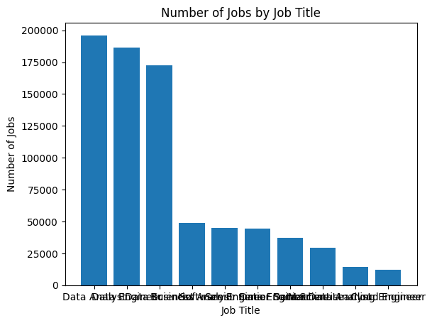
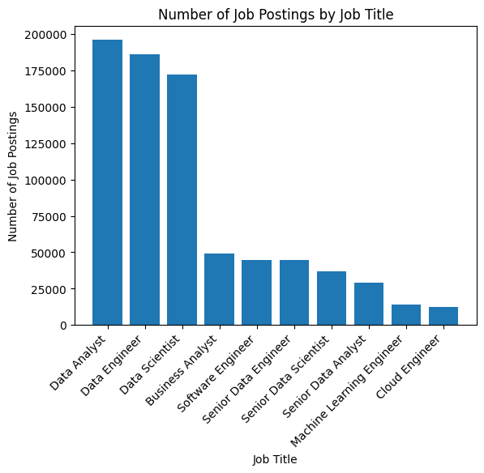

# Labeling  

## Before

```python
job_count = df.job_title_short.value_counts()
plt.bar(job_count.index, job_count)
plt.show() # it'a mess in the x axis when we print it like this, so its labeling 
```


## After

```python
job_count = df.job_title_short.value_counts()
plt.bar(job_count.index, job_count)
plt.xlabel('Job Title')
plt.ylabel('Number of Job Postings')
plt.title('Number of Job Postings by Job Title')
plt.xticks(rotation=45, ha='right') # ha-> horizontal allignment by default its 'centre
plt.show()
```

